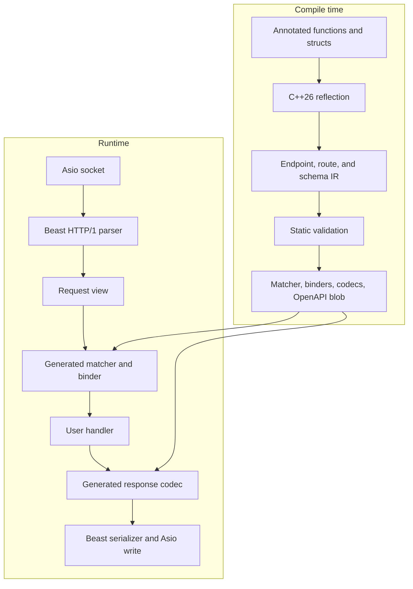
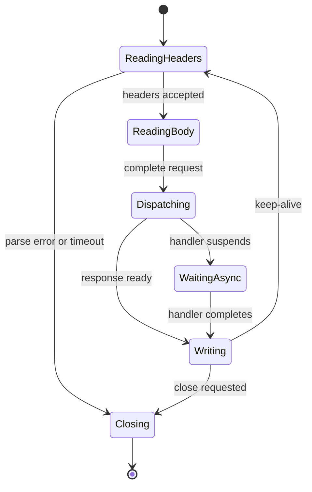

# Flash: C++26 Compile-Time REST Framework

**Product specification, proposed system design, implementation plan, and user guide**  
**Status:** Proposed architecture for v0.1  
**Working name:** `flash` (provisional; perform a name/trademark/package search before public release)  
**Primary development target:** Native Windows 11, MSYS2 UCRT64, GCC/G++ 16.2, CMake 4.4, Ninja, Conan 2  
**Document date:** 2026-09-03

> **Project thesis**
>
> Flash should make ordinary C++ REST endpoints nearly as concise and automatic as FastAPI while compiling endpoint discovery, route analysis, argument binding, schema derivation, validation structure, handler dispatch, response serialization, and API documentation into specialized code. At runtime, Boost.Asio and Boost.Beast handle networking and HTTP/1.1; Flash should add as little allocation, indirection, branching, and metadata interpretation as practical.

This document is simultaneously:

- a **declarative specification** of the product users should receive and the behavior and performance it should meet;
- an **imperative design proposal** for building it;
- a **development plan** with milestones and verification gates; and
- the initial **setup and user manual** for the framework.

Normative words such as **MUST**, **SHOULD**, and **MAY** describe product requirements. Sections labeled **Proposed design** are strong recommendations, but may change through measurement or compiler constraints. Code labeled **target API** specifies the desired user experience; it is not a claim that the unimplemented framework already compiles.

## Contents

1. [Executive summary](#1-executive-summary)
2. [Product definition](#2-product-definition)
3. [Product requirements](#3-product-requirements)
4. [Measurable success criteria](#4-measurable-success-criteria)
5. [Proposed architecture](#5-proposed-architecture)
6. [Key architectural decisions](#6-key-architectural-decisions)
7. [Implementation plan](#7-implementation-plan)
8. [Repository and engineering workflow](#8-repository-and-engineering-workflow)
9. [Developer setup for this Windows machine](#9-developer-setup-this-windows-machine)
10. [Framework user guide](#10-framework-user-guide)
11. [Benchmarking specification](#11-benchmarking-specification)
12. [Troubleshooting](#12-troubleshooting)
13. [Risks and mitigations](#13-risks-and-mitigations)
14. [Open design questions](#14-open-design-questions)
15. [Definition of done for v0.1.0](#15-definition-of-done-for-experimental-v010)
16. [Suggested README structure](#16-suggested-readme-structure)
17. [Source basis and standards](#17-source-basis-and-standards)
18. [Immediate next actions](#18-immediate-next-actions)

---

## 1. Executive summary

Flash is an experimental C++26 HTTP/REST framework built around a simple question:

> How much of a modern web framework can disappear before the program runs?

The user should be able to write this:

```cpp
#include <flash/flash.hpp>

struct User {
    std::uint64_t id;
    std::string name;
};

namespace api {

[[=flash::get("/users/{id}")]]
User get_user(std::uint64_t id) {
    return users::find(id);
}

} // namespace api

int main() {
    return flash::serve<^^api>({.port = 8080});
}
```

From that source, the framework should derive:

- the HTTP method and path;
- the path parameter name and type;
- the function invocation adapter;
- the JSON schema and serializer for `User`;
- error responses for invalid parameters;
- the OpenAPI operation and component schema; and
- a statically specialized route-dispatch path.

The application should not contain a mutable route registry, runtime reflection database, string-keyed parameter map, serializer registry, `std::function` handler table, or per-request schema interpreter unless the user explicitly selects a feature that requires one.

### Recommended foundation

| Layer | Proposed choice | Reason |
| --- | --- | --- |
| Language | C++26 static reflection | Direct inspection of functions, parameters, structs, fields, and annotations without macros or duplicate schemas |
| Primary compiler | GCC 16.2 | GCC 16 implements P2996 reflection, annotations, and function-parameter reflection behind `-freflection` |
| Transport/event loop | Boost.Asio | Mature asynchronous I/O and native Windows IOCP integration |
| HTTP/1.1 framing | Boost.Beast | A deliberately low-level HTTP foundation intended for higher-level frameworks |
| Build | CMake + Ninja + presets | Matches the existing machine setup and supports reproducible target-level configuration |
| Dependencies | Conan 2 | Project-scoped, pinned dependencies instead of expanding global MSYS2 packages |
| JSON | Reflection-generated typed codec behind a policy boundary | Preserves the central experiment while allowing a bootstrap codec and future alternatives |
| API description | OpenAPI 3.1.1 + JSON Schema 2020-12 | Broad tooling compatibility and direct schema alignment |
| Tests | CTest plus a lightweight unit-test framework | Supports normal, integration, golden, and expected-compile-failure tests |
| Benchmarks | Same-transport handwritten Beast baseline first | Isolates Flash overhead from transport and HTTP-parser differences |

### Principal constraints

1. **GCC needs an extra flag.** Reflection is enabled with both `-std=c++26` and `-freflection`; the current baseline preset needs the latter added to Flash targets.
2. **clangd cannot parse the core feature yet.** Upstream Clang currently reports P2996 and P3394 as unsupported. clangd remains useful for ordinary runtime code, but G++ diagnostics and tests are authoritative for reflection-heavy code.
3. **Default argument values are not reflectable.** Function-parameter reflection exposes whether a default exists, but not the expression or resulting value. Flash must use explicit default metadata, `std::optional`, or constrained omission rules rather than inventing inaccessible values.
4. **Beast is HTTP/1-focused and deliberately not a turnkey server.** This is a good architectural boundary for v0.1, but Flash itself must supply server lifecycle, routing, limits, errors, middleware, and observability.
5. **Performance claims must be relative and reproducible.** Absolute requests-per-second numbers are machine- and workload-dependent. The primary success metric is overhead versus a handwritten server using the same Beast/Asio substrate and equivalent semantics.

---

## 2. Product definition

### 2.1 Product statement

Flash is a static REST framework for applications whose endpoint set is known at build time. It combines high information density at the call site with a runtime specialized to exactly the declared API.

The framework is intended for:

- typed internal services;
- low-latency JSON APIs;
- small and medium REST services where executable size and predictable behavior matter;
- developers who want automatic validation and OpenAPI without a dynamic framework runtime; and
- research and benchmarking of C++26 reflection as a practical systems-programming tool.

It is not simply “FastAPI rewritten in C++.” The intended differentiator is that FastAPI-like declarations become inputs to a compile-time API compiler.

### 2.2 Target users

**Primary user:** A competent C++ developer who wants to expose typed functions as HTTP endpoints without manually parsing requests, building response objects, registering serializers, or maintaining a separate OpenAPI file.

**Secondary user:** A performance-sensitive systems developer who wants raw access when needed and expects abstractions to be measurable rather than merely advertised as “zero cost.”

**Contributor:** A modern C++ developer comfortable working around early compiler support and testing compile-time behavior.

### 2.3 Core user promise

For a conventional JSON REST endpoint, the user SHOULD need to specify only information that cannot be inferred safely:

- an HTTP method and path;
- a normal C++ function signature;
- ordinary C++ request and response types; and
- metadata for semantics that C++ types and names cannot express.

The framework MUST infer everything else or reject the program at compile time with an actionable diagnostic.

### 2.4 Design principles

1. **The public API is boring; the implementation may be sophisticated.** Users should not perform template metaprogramming to declare an endpoint.
2. **Move decisions, not bytes, to compile time.** Runtime still has to read sockets, parse bytes, validate inputs, execute business logic, and write bytes. Compile time should eliminate repeated decisions about what those operations mean for a particular endpoint.
3. **Pay only for selected behavior.** Disabled docs, logging, TLS, metrics, validation rules, codecs, and exception translation should compile out where practical.
4. **The executable is the API.** v0.1 routes are immutable after compilation.
5. **Make invalid configurations unrepresentable.** Route conflicts, unbound parameters, unsupported types, duplicate field names, impossible response mappings, and invalid annotation combinations should fail the build.
6. **Expressive cold path, ruthless hot path.** Detailed error bodies and diagnostics are worth code on error paths; successful requests should avoid generic metadata traversal and dynamic dispatch.
7. **Views by default, ownership explicitly.** Parse from request buffers through views; allocate only when the endpoint’s type requires ownership.
8. **Measure abstraction cost.** Every major feature needs instruction, allocation, latency, throughput, compile-time, and binary-size evidence where applicable.
9. **Keep escape hatches honest.** A raw endpoint must permit direct request-buffer and response-writer use without routing through the typed JSON layer.
10. **Do not claim production readiness before adversarial testing.** Early releases should be explicit experimental previews.

### 2.5 Non-goals for v0.1

Flash v0.1 will not attempt to provide:

- dynamically added or removed routes;
- an ORM, database abstraction, migration system, or dependency-injection container;
- an HTML templating system or frontend framework;
- HTTP/2, HTTP/3, QUIC, or WebSocket application abstractions;
- a custom TCP stack or a from-scratch HTTP/1 parser;
- multipart upload streaming, range serving, compression negotiation, or proxy behavior;
- transparent distributed tracing exporters;
- ABI stability across compiler versions;
- full compiler portability beyond the pinned GCC implementation; or
- a blanket claim that every ergonomic layer is literally free.

These may become later work, but none should delay a coherent, measured HTTP/1.1 JSON framework.

---

## 3. Product requirements

### 3.1 Endpoint declaration

Flash MUST support namespace-scope function endpoints discovered from a reflected namespace:

```cpp
namespace api {

[[=flash::get("/health")]]
Health health();

[[=flash::post("/orders")]]
OrderReceipt submit_order(CreateOrder order);

}

int main() {
    return flash::serve<^^api>({.port = 8080});
}
```

Required methods for v0.1:

- `GET`
- `POST`
- `PUT`
- `PATCH`
- `DELETE`
- `HEAD`
- `OPTIONS`

The annotation is the only mandatory endpoint-specific syntax. Endpoint discovery MUST be deterministic and limited to declarations visible before the reflection point.

Because parameter-name reflection enforces consistency across reachable declarations, endpoint declarations and definitions MUST use consistent parameter names. v0.1 SHOULD recommend defining an API in one included header or in the same translation unit before `serve<^^api>`; inconsistent or unavailable parameter identifiers must produce a focused compile-time error rather than silently changing inference.

### 3.2 Parameter-source inference

Flash MUST follow stable, documented inference rules.

| Condition | Default source |
| --- | --- |
| Parameter name appears as `{name}` in the route | Path |
| Scalar-like parameter not present in path | Query |
| One reflectable object parameter on POST/PUT/PATCH | JSON body |
| `flash::request_context&` | Framework context |
| Explicit source annotation/wrapper | Annotated source |
| Anything ambiguous | Compile-time error |

“Scalar-like” initially includes booleans, integral and floating types, enums with supported conversion, `std::string`, `std::string_view`, and explicitly registered scalar codecs.

GET, HEAD, and DELETE MUST NOT infer a JSON body by default. A body on those methods requires explicit metadata.

Example target API:

```cpp
[[=flash::get("/users/{id}")]]
User get_user(std::uint64_t id, bool verbose);
// id      -> path
// verbose -> required query

[[=flash::post("/users")]]
User create_user(CreateUser user);
// user -> JSON body
```

### 3.3 Explicit parameter metadata

The framework MUST provide readable escape hatches for semantics that inference cannot capture:

```cpp
[[=flash::post("/reports/{team}")]]
Report make_report(
    std::string team,
    [[=flash::header("X-Request-ID")]] std::string_view request_id,
    [[=flash::query("limit"), =flash::default_value(100)]] int limit,
    [[=flash::body]] ReportRequest request,
    flash::request_context& context);
```

v0.1 SHOULD support annotations for:

- `path("external-name")`
- `query("external-name")`
- `header("Header-Name")`
- `cookie("cookie-name")`
- `body`
- `default_value(value)`
- `description(text)`
- `deprecated`
- validation constraints described later

Wrapper types such as `flash::header<T>` MAY be provided for cases where annotations are awkward, but they should not be required for ordinary parameters.

### 3.4 Optionality and defaults

Required semantics:

- `std::optional<T>` means the input may be absent.
- A parameter with `[[=flash::default_value(v)]]` is optional and receives `v` when absent.
- A C++ default argument may be used automatically only when generated invocation can legally omit the missing trailing suffix.
- Flash MUST NOT claim to know the value of a C++ default argument from reflection.
- If multiple defaulted query parameters permit a runtime presence pattern that cannot be expressed by positional omission, compilation MUST request explicit default metadata or `std::optional`.

Recommended user code:

```cpp
[[=flash::get("/search")]]
Results search(
    std::string q,
    [[=flash::default_value(20)]] int limit,
    std::optional<std::string> cursor);
```

This is one small place where the C++ API cannot be identical to FastAPI without lying about available reflection data.

### 3.5 Body model and JSON mapping

Plain public aggregates SHOULD serialize and deserialize without registration:

```cpp
struct CreateOrder {
    std::string symbol;
    double price;
    std::uint32_t quantity;
};
```

Initial supported mapping:

| C++ type | JSON representation |
| --- | --- |
| `bool` | boolean |
| integral type | integer with range checking |
| floating type | number; reject non-finite values by default |
| `std::string` | string |
| `std::string_view` | borrowed string view when safe |
| enum | string name by default; configurable numeric representation |
| `std::optional<T>` | value or `null`; missing member accepted |
| `std::vector<T>` | array |
| `std::array<T, N>` | fixed-length array |
| reflectable public aggregate | object using reflected member names |

The default codec MUST:

- reject numeric overflow and underflow;
- distinguish missing, `null`, and present values;
- reject duplicate object keys by default;
- reject unknown fields by default in strict mode and permit them in a selected permissive policy;
- enforce configurable nesting, member-count, string-size, array-size, and body-size limits;
- generate field-specific errors without constructing a generic DOM on the successful path; and
- define string-view lifetime precisely.

### 3.6 Validation metadata

Target syntax:

```cpp
struct CreateUser {
    [[=flash::min_length(1), =flash::max_length(64)]]
    std::string name;

    [[=flash::minimum(0), =flash::maximum(150)]]
    int age;

    [[=flash::pattern("^[^@]+@[^@]+$")]]
    std::string email;
};
```

Required v0.1 constraints:

- numeric minimum/maximum, inclusive and exclusive;
- string minimum/maximum length;
- array minimum/maximum items;
- field rename/alias;
- field description and deprecation;
- enum values;
- optional versus required;
- a custom validator callable with a stable error contract.

Regex/pattern validation SHOULD be supported, but it need not be on the first implementation critical path. Schema annotations MUST drive both runtime validation and generated API documentation so they cannot drift.

### 3.7 Return-value mapping

The default mapping MUST be unsurprising:

| Handler result | HTTP response |
| --- | --- |
| Reflectable/scalar `T` | `200 OK`, JSON body |
| `void` | `204 No Content` |
| `flash::created<T>` | `201 Created`, JSON body |
| `flash::response<T>` | Explicit status, headers, and typed body |
| `flash::text` | `text/plain` |
| `flash::bytes` | `application/octet-stream` |
| `std::expected<T, E>` | Success mapping for `T`; registered problem mapping for `E` |
| Unhandled exception in exception-enabled policy | `500`, correlation ID, no leaked internals |

Raw `std::string` SHOULD serialize as a JSON string by default. Plain text must be explicit to avoid response-type ambiguity.

Target API:

```cpp
[[=flash::delete_("/users/{id}")]]
std::expected<void, UserError> delete_user(std::uint64_t id);

[[=flash::get("/version")]]
flash::text version() {
    return flash::text{"1.4.0"};
}
```

### 3.8 Errors

Client-visible errors MUST use one stable media type and schema. Proposed default: RFC 9457 Problem Details with the `application/problem+json` media type and a bounded Flash `errors` extension.

```json
{
  "type": "https://flash.dev/problems/invalid-parameter",
  "title": "Invalid request parameter",
  "status": 422,
  "detail": "Path parameter 'id' must be an unsigned integer.",
  "instance": "/users/banana",
  "errors": [
    {
      "location": ["path", "id"],
      "code": "invalid_integer",
      "message": "Expected an unsigned integer."
    }
  ],
  "request_id": "01J..."
}
```

Minimum mappings:

- malformed request syntax -> `400`
- authentication absent/invalid, when provided by user middleware -> `401`
- authorization denied -> `403`
- no route -> `404`
- path exists for another method -> `405` plus `Allow`
- unsupported content type -> `415`
- body too large -> `413`
- syntactically valid but unbindable/invalid input -> `422`
- uncaught internal failure -> `500`
- timeout -> appropriate `408` or server policy response when a response remains safe

Detailed errors MAY allocate because they are cold-path behavior. They MUST never echo secrets, raw authorization headers, stack traces, or unbounded request contents by default.

### 3.9 OpenAPI and documentation

Flash MUST derive an OpenAPI document from the same compile-time endpoint and schema IR used for runtime code.

v0.1 target:

- OpenAPI 3.1.1 output;
- JSON Schema 2020-12-compatible component schemas;
- `/openapi.json` enabled in debug/development preset;
- `/docs` serving a minimal embedded or explicitly CDN-backed UI in development;
- a build tool or example executable that writes `openapi.json` for CI artifact validation;
- stable ordering for clean diffs and golden tests; and
- compile-time exclusion of documentation endpoints and assets in a minimal production policy.

OpenAPI 3.2 is newer, but 3.1.1 is proposed as the initial default because ecosystem compatibility matters more than using the newest version label. A later policy may emit 3.2.

### 3.10 Synchronous and asynchronous handlers

Both forms SHOULD be supported:

```cpp
[[=flash::get("/health")]]
Health health();

[[=flash::get("/quotes/{symbol}")]]
flash::task<Quote> quote(std::string_view symbol);
```

Rules:

- synchronous handlers run on an I/O worker and MUST NOT block for substantial time;
- `flash::task<T>` is the stable public coroutine type and may initially be an alias/adaptor over `boost::asio::awaitable<T>`;
- asynchronous handlers may suspend using the selected Asio executor;
- v0.1 MAY provide an explicit blocking-work executor but MUST NOT silently move arbitrary synchronous functions between threads;
- request-buffer views remain valid until the handler completes, including across suspension, because their owning session/request state remains alive;
- user-retained views after handler completion are invalid unless explicitly copied or promoted to owned storage.

### 3.11 State and dependencies

Flash MUST avoid a runtime service-locator or reflection-driven dependency injection container.

Proposed model:

```cpp
struct Services {
    UserStore users;
    Metrics metrics;
};

[[=flash::get("/users/{id}")]]
User get_user(std::uint64_t id, flash::state<Services>& services) {
    return services->users.find(id);
}

int main() {
    Services services{/*...*/};
    return flash::serve<^^api>({.port = 8080}, services);
}
```

State is registered at application construction, referenced by type, and stored outside per-request scratch memory. Duplicate registrations of the same unqualified type MUST be rejected unless named keys are used.

### 3.12 Middleware

Middleware SHOULD compose as a statically typed chain:

```cpp
using App = flash::application<
    flash::middleware::request_id,
    flash::middleware::access_log,
    AuthMiddleware,
    flash::middleware::recover_exceptions
>;
```

The chain SHOULD be compiled as nested direct calls, not a vector of virtual handlers. Middleware may:

- inspect or reject a request before binding;
- add request-local state;
- time handler execution;
- modify response headers;
- translate domain errors; and
- observe completion.

Order MUST be explicit. Any middleware that forces body buffering, allocation, synchronization, or exception handling MUST document that cost.

### 3.13 Raw escape hatch

Advanced users MUST be able to bypass typed binding and JSON:

```cpp
[[=flash::get("/raw")]]
flash::task<void> raw(
    flash::raw_request_view request,
    flash::raw_response_writer& response) {
    response.status(200);
    response.header("Content-Type", "text/plain");
    co_await response.write("ok");
}
```

This path should retain static route dispatch while exposing request bytes, headers, body chunks, and response writing. It is the comparison point for evaluating typed-layer overhead.

---

## 4. Measurable success criteria

### 4.1 Ergonomics targets

The v0.1 release candidate MUST demonstrate these examples without handwritten parsing or schema registration:

1. health endpoint;
2. typed path parameter;
3. required and optional query parameters;
4. JSON body to aggregate;
5. validation constraints;
6. typed error with non-200 status;
7. async endpoint;
8. state access;
9. custom header input; and
10. raw response escape hatch.

For a basic typed JSON endpoint, framework-specific source SHOULD be no more than:

- one route annotation;
- the normal function signature; and
- zero registration, serializer, parser, or OpenAPI declarations.

### 4.2 Runtime performance targets

Performance must be evaluated against a handwritten Beast/Asio implementation with the same:

- compiler and flags;
- HTTP parser and network model;
- keep-alive behavior;
- thread count and affinity;
- JSON semantics and payload;
- validation behavior;
- logging/metrics configuration; and
- client/load-generator configuration.

Proposed release gates:

| Metric | v0.1 target |
| --- | --- |
| Framework throughput on trivial typed GET | At least 90% of equivalent handwritten same-substrate baseline |
| Median server-side framework overhead | At most 10% above baseline or at most 100 ns, whichever allowance is larger |
| p99 server-side framework overhead below saturation | At most 15% above baseline |
| Dynamic allocations, route + scalar bind + fixed response after warm-up | 0 framework allocations/request |
| Dynamic allocations, typed JSON body | 0 framework allocations beyond ownership required by user-selected C++ fields and configured buffers |
| Runtime dynamic dispatch for endpoint invocation | 0 indirect handler calls required by framework |
| Runtime route/schema registry traversal | 0 |
| Steady-state metadata lookup by parameter name | 0 string-keyed maps |
| Dropped/failed requests under supported load | 0 unexplained failures |

The nanosecond allowance prevents measurement noise on tiny functions from making a percentage gate meaningless. Claims must state payload, concurrency, build, hardware, and sample methodology.

### 4.3 Latency and capacity reporting

Every published end-to-end result MUST include:

- throughput;
- p50, p90, p99, and p99.9 latency;
- offered load and achieved load;
- connection count;
- keep-alive setting;
- payload sizes;
- CPU utilization and worker count;
- allocator counts;
- build preset and commit;
- whether client and server share a machine; and
- the saturation point or evidence the test stayed below it.

Do not publish only maximum requests/second. Closed-loop clients can hide queueing behavior and coordinated omission can make latency percentiles misleading.

### 4.4 Compile-time and binary budgets

Compile-time work is not free; it is shifted from runtime to development and build infrastructure.

Proposed budgets on the primary laptop, measured after dependencies are built:

| Workload | Target |
| --- | --- |
| Clean build of framework tests/examples | <= 60 seconds in Release |
| Incremental rebuild after one endpoint body changes | <= 5 seconds |
| Incremental rebuild after one reflected schema changes | <= 15 seconds |
| Peak compiler memory for 100-route synthetic API | <= 2 GiB |
| Minimal stripped example binary, no TLS/docs | Track and regress; initial goal <= 3 MiB, not a hard v0.1 blocker |
| Per-added-simple-route text growth | Measure; investigate regressions above 2 KiB before deduplication decisions |

These are engineering budgets, not marketing promises. If measurements differ, publish the result and adjust architecture or the documented budget.

### 4.5 Correctness and quality gates

Before v0.1:

- all supported parameter and field types have success, boundary, and failure tests;
- every compile-time diagnostic category has an expected-compile-failure test;
- route precedence is exhaustively tested for the supported grammar;
- parser/binder limits have adversarial tests;
- OpenAPI output passes an external validator and golden diff;
- ASan/UBSan tests pass on a supported GCC/Linux CI environment;
- native Windows Debug and Release tests pass;
- malformed-input corpus produces no crash, hang, or unbounded allocation;
- connection timeouts and cancellation tests pass; and
- benchmark results are reproducible from repository commands.

### 4.6 Readiness labels

| Label | Meaning |
| --- | --- |
| `experimental` | API and compiler may change; not audited; no production claim |
| `preview` | End-to-end features work; performance and negative tests present; still no compatibility guarantee |
| `beta` | Versioned API policy, security review, sustained fuzzing, documented operational limits |
| `stable` | Explicit compatibility contract, production evidence, supported upgrade path |

The first public release should be labeled **experimental**.

---

## 5. Proposed architecture

### 5.1 System overview



### 5.2 Major components

```text
flash/
  include/flash/
    flash.hpp                 public umbrella
    annotations.hpp           route, source, validation metadata values
    response.hpp              typed response and error types
    context.hpp               request context and state access
    policies.hpp              compile-time configuration
    meta/                     reflection and compile-time IR
    routing/                  route grammar and generated matcher
    binding/                  typed input extraction
    json/                     schema lowering and codecs
    openapi/                  schema and document emission
  src/runtime/
    server.cpp                listener and lifecycle
    session.cpp               connection/request state machine
    request_view.cpp          stable request abstraction over Beast buffers
    errors.cpp                problem responses
    metrics.cpp               optional counters/histograms
  tests/
    unit/
    compile_fail/
    integration/
    conformance/
    fuzz/
  benchmarks/
    micro/
    end_to_end/
    baselines/beast/
  examples/
    hello/
    crud/
    async/
    raw/
  cmake/
  docs/
```

### 5.3 Hybrid library shape

Do not make the whole project header-only merely because reflection uses templates.

Proposed split:

- **`flash::meta` interface/header layer:** annotations, reflection, endpoint/schema IR, generated adapters, policies.
- **`flash::runtime` compiled static library:** Asio/Beast server machinery, session state, buffer management, common error formatting, optional metrics.
- **`flash::flash` consumer target:** links both and propagates required compile features/options.

Benefits:

- reflection-generated code remains visible where instantiation requires it;
- non-specialized networking code compiles once;
- consumer compile times and code duplication are contained;
- implementation details do not all become public API; and
- the project can later explore explicit instantiation or C++ modules without committing v0.1 to experimental module tooling.

### 5.4 Compile-time API compiler

The compiler pipeline should be explicit rather than spread through unrelated template instantiations.


#### Stage 1: discovery

Given `^^api`, enumerate namespace members visible at the reflection point and select functions carrying exactly one Flash route annotation.

For each endpoint capture:

- function reflection;
- method and path annotation;
- parameter reflections, identifiers, adjusted types, and annotations;
- return type;
- function-level description/tags/status metadata; and
- source-location information when the implementation exposes it usefully.

#### Stage 2: normalization

Convert reflection values into a small structural compile-time IR. Do not attempt to retain a runtime `std::meta::info` registry.

Suggested concepts:

```cpp
enum class source_kind { path, query, header, cookie, body, context, state };

struct parameter_ir {
    fixed_string cpp_name;
    fixed_string wire_name;
    source_kind source;
    type_token type;
    bool required;
    validation_ir validation;
};

struct endpoint_ir {
    http_method method;
    route_ir route;
    static_vector<parameter_ir, max_parameters> parameters;
    response_ir response;
    endpoint_options options;
};
```

`type_token` is conceptual. Compile-time code that needs the actual type should retain it through templates/splices; runtime data should contain only compact enums, offsets, and literals needed for execution.

#### Stage 3: validation

Perform whole-API checks before code generation:

- route syntax is valid;
- route parameter names are unique;
- every route placeholder binds exactly one parameter;
- every parameter has exactly one source;
- body inference yields at most one body;
- method/body combinations obey policy;
- endpoint shapes do not conflict;
- annotations apply to compatible types;
- defaults are representable;
- every request and response type has a codec;
- JSON field names are unique after aliases;
- recursive schemas are supported or rejected clearly;
- error mappings are complete; and
- generated OpenAPI operation IDs are unique.

Diagnostics should identify both conflicting declarations and explain the repair. Prefer a targeted `static_assert`/reflection diagnostic over a hundred-line failed substitution trace.

#### Stage 4: lowering

Partition endpoints by method, compile route segments, bind parameter-source indices, instantiate type parsers/validators, build response adapters, and build schema component references.

#### Stage 5: generation

Instantiate only the code used by the application:

- method dispatcher;
- route decision structure;
- per-endpoint binder;
- direct handler invocation;
- request/response codecs;
- middleware chain;
- error adapters; and
- optional OpenAPI/docs resources.

### 5.5 Route grammar

v0.1 route grammar should remain deliberately small:

```text
route          := "/" | "/" segment ("/" segment)*
segment        := static-segment | parameter-segment | catch-all
parameter      := "{" identifier "}"
catch-all      := "{" "*" identifier "}"
```

Examples:

```text
/
/health
/users/{id}
/users/{id}/orders/{order_id}
/assets/{*path}
```

Rules:

- static segments outrank parameter segments;
- parameter segments outrank catch-all;
- only one parameter edge and one catch-all edge may leave a trie node for a method;
- two routes differing only in placeholder names conflict;
- trailing-slash behavior is a compile-time policy: strict by default, optional redirect policy;
- percent decoding occurs after structural segmentation, with malformed encodings rejected;
- decoded `/` MUST NOT silently change segment boundaries;
- dot-segment normalization is disabled for API routes unless an explicit policy specifies it; and
- query strings are not part of route matching.

Do not initially use parameter type to resolve ambiguous route shapes such as `/{id:int}` versus `/{name:string}`. That makes routing depend on parse success and produces surprising 404/422 behavior. Add typed route constraints later only with a complete precedence design.

### 5.6 Matcher design

Start with a compile-time-built segment trie specialized by method. It is easy to validate, inspect, and benchmark.

For a small API:

```text
GET
  /
    health -> endpoint 0
    users
      {parameter} -> endpoint 1
      search      -> endpoint 2

POST
  /
    users -> endpoint 3
```

Runtime algorithm:

1. map Beast verb to a compact method enum;
2. split path into non-owning segment views;
3. compare static edges using length plus bytes;
4. record views for parameter edges in fixed endpoint-order slots;
5. return a statically known endpoint adapter or compact endpoint index dispatched through a generated switch;
6. return 405 plus precomputed `Allow` when the path shape exists under other methods;
7. otherwise return 404.

The first implementation SHOULD use generated switches/direct template calls. Benchmark a function-pointer table only as an alternative. Avoid `std::function`.

Future matcher experiments may include a DFA, radix tree, minimal perfect hash for static routes, or profile-guided decision tree. Replace the trie only when evidence shows a meaningful win without unacceptable compile-time or code-size cost.

### 5.7 Request representation

`request_view` should wrap the parsed Beast request while exposing stable, framework-oriented operations:

```cpp
class request_view {
public:
    http_method method() const noexcept;
    std::string_view target() const noexcept;
    std::string_view path() const noexcept;
    query_view query() const noexcept;
    header_range headers() const noexcept;
    std::span<const std::byte> body() const noexcept;
};
```

Views point into session-owned input storage. The request state owns:

- Beast parser/message state;
- flat/static receive buffer;
- decoded-path scratch when percent decoding is necessary;
- query index scratch;
- body storage or stream state;
- cancellation and deadline state; and
- request-local arena.

The framework MUST document invalidation precisely. A handler that wants data after the request completes must copy it.

### 5.8 Binding pipeline

Each endpoint receives a dedicated binder equivalent to handwritten code:

```text
matched segments
  -> parse path values
  -> find and parse only declared query/header/cookie values
  -> parse body directly into target type
  -> validate
  -> invoke handler with typed values
```

No generic parameter descriptor loop should run on the successful hot path unless benchmarking proves it is equivalent and materially reduces code size.

Query parsing should scan once. For few declared keys, direct comparison against compile-time names may beat building a map. Establish a threshold through benchmarks; a fixed small index may be preferable for endpoints with many parameters.

### 5.9 JSON codec architecture

The JSON layer is part of the core thesis because reflection can remove duplicate user schemas and generic runtime dispatch. It should nevertheless sit behind a policy concept:

```cpp
template<class Codec>
concept json_codec = requires(Codec c, input_cursor in, output_buffer& out) {
    c.template read<MyType>(in);
    c.template write<MyType>(out, std::declval<MyType const&>());
};
```

Recommended implementation sequence:

1. **Bootstrap adapter:** use a reliable existing JSON parser to validate endpoint, error, and schema architecture. Accept that this version may allocate or build a DOM.
2. **Native typed reader:** implement a cursor/SAX-style reader that uses reflection-generated field matching and writes directly into `T`.
3. **Native typed writer:** emit directly from reflected fields into a reusable output buffer.
4. **Optimize only measured bottlenecks:** field-name dispatch, escaping, number parsing/formatting, and buffer growth.

For object fields, generate a compile-time decision structure over known field names. Candidate strategies:

- length-first comparisons for small structs;
- switch on a small stable hash followed by equality verification;
- perfect hash for larger schemas; or
- sorted table plus binary search when code size matters.

Always verify equality after hashing. Unknown/duplicate-field policy should be compiled into the reader.

The codec MUST support a user extension point for semantic types such as UUID, timestamp, decimal, and domain IDs without making all types globally mutable at runtime.

### 5.10 OpenAPI generation

Build OpenAPI from normalized endpoint/schema IR, not by separately reflecting everything again.

Proposed outputs:

1. a deterministic compile-time/static JSON blob embedded in development builds;
2. an executable or CMake target that writes the exact blob to `build/generated/openapi.json`; and
3. a test that validates and golden-diffs it.

Stable generation rules:

- component name defaults to qualified C++ type name normalized for OpenAPI;
- explicit schema-name annotation resolves collisions;
- operation ID defaults to qualified function name;
- paths, methods, parameters, responses, schemas, and properties use deterministic ordering;
- recursion uses `$ref` and detects unsupported cycles;
- validation annotations map to both JSON Schema and runtime validators; and
- descriptions are escaped and size-limited at compile time.

The runtime does not need an object graph representing the OpenAPI document. It serves static bytes.

### 5.11 Server runtime

Proposed v0.1 model:

- one `boost::asio::io_context`;
- configurable worker thread count, defaulting to a conservative hardware-derived value;
- one asynchronous accept loop;
- one session object per connection;
- serialized operations per session using executor discipline/strand where necessary;
- one outstanding read and one ordered write path per connection;
- keep-alive support;
- bounded HTTP pipelining queue or sequential request handling initially;
- request header/body/read/write/idle deadlines;
- graceful stop that closes the listener, cancels idle work, drains within a timeout, then terminates remaining sessions.



Blocking handlers are a user error unless explicitly scheduled onto a blocking executor. The framework should expose executor/thread behavior plainly rather than hiding it behind “automatic” scheduling.

### 5.12 Memory management

Per-session/request memory proposal:

- a reusable Beast flat/static buffer for network input;
- configurable maximum header bytes and field count;
- configurable body limit set on the parser before reading the body;
- a small monotonic request arena reset after completion;
- fixed-capacity storage for common path/query bindings;
- a reusable response buffer with geometric growth and retained capacity limit;
- optional streaming body types for large payloads; and
- allocator instrumentation compiled into benchmark/debug policies.

“Zero allocation” MUST always state its boundary. The framework can avoid allocating to route and bind an integer, but cannot promise that constructing a returned `std::string` or `std::vector` allocates nothing. Benchmark reports should distinguish:

- framework internal allocations;
- transport/parser allocations;
- user object allocations; and
- operating-system/socket allocations.

### 5.13 Compile-time policy system

Use policy types for choices that should remove unused code:

```cpp
using Server = flash::server<
    flash::transport::beast_http1,
    flash::json::native,
    flash::errors::problem_json,
    flash::docs::development,
    flash::logging::basic,
    flash::exceptions::translate,
    flash::routing::static_trie
>;
```

Provide friendly presets:

```cpp
using Server = flash::development_server<>;
using Server = flash::performance_server<>;
using Server = flash::minimal_server<>;
```

Do not expose every internal knob as a template parameter. Runtime values such as port, address, thread count, size limits, and timeouts should remain ordinary configuration when changing them does not justify a new binary.

### 5.14 Observability

Minimum built-in observability:

- request count by method/status class;
- active connections;
- rejected/oversized/timed-out request counts;
- handler and end-to-end duration histograms behind an enabled metrics policy;
- structured access-log hook;
- request/correlation ID propagation; and
- user hook for domain metrics.

The minimal/performance preset may compile these out. Metrics names and cardinality must be bounded; raw path parameters MUST NOT become labels.

### 5.15 Security and resource limits

Secure defaults matter even in an experimental server:

- reject conflicting message framing and defer RFC-compliant HTTP parsing to Beast;
- set finite header, field-count, body, nesting, array, and string limits;
- apply header/read/body/write/idle timeouts;
- reject CR/LF in user-set header values;
- validate percent encoding and path handling;
- avoid reflecting private members without explicit opt-in;
- never expose exception text or stack traces in production policy;
- cap error-detail sizes;
- clear or avoid logging authorization/cookie values;
- make TLS explicit; and
- recommend deployment behind a mature reverse proxy until Flash earns a production-readiness label.

v0.1 should support plain HTTP directly. TLS via Boost.Asio/OpenSSL may be a feature flag or v0.2 milestone. Production documentation must never imply that plain HTTP is acceptable over an untrusted network.

---

## 6. Key architectural decisions

### ADR-001: GCC 16.2 is the reference compiler

**Decision:** Pin and test GCC 16.2 first; require `-std=c++26 -freflection` on reflection consumers.

**Why:** GCC 16 is the mainstream compiler line implementing the required reflection, annotation, and function-parameter features. The user already has the correct UCRT64 GCC/G++ toolchain.

**Consequences:** Clang/MSVC are unsupported initially. Compiler bugs are an expected project risk. CI and documentation must pin known-good compiler versions.

### ADR-002: Use reflected namespace discovery

**Decision:** The primary API is `serve<^^api>` over annotated namespace-scope functions.

**Why:** This most closely matches the information density of decorators while avoiding a separate endpoint list.

**Fallback:** If a GCC defect blocks namespace enumeration or annotations, temporarily support an explicit compile-time list:

```cpp
constexpr auto routes = flash::api<^^get_user, ^^create_user>();
return flash::serve<routes>(config);
```

The fallback is a compatibility mechanism, not the preferred public API.

### ADR-003: Boost.Asio + Beast own transport and HTTP/1.1

**Decision:** Do not write TCP or HTTP/1.1 framing from scratch.

**Why:** Beast explicitly positions itself as a low-level HTTP/WebSocket foundation rather than a turnkey server, and leaves routing to higher layers. That is precisely the boundary Flash needs.

**Consequences:** HTTP/2 is out of scope. Beast overhead must be measured; lower-level use of its parser/serializer can be adopted if generic message construction dominates.

### ADR-004: Static route set only

**Decision:** No runtime registration or mutation in v0.1.

**Why:** Whole-program route validation and specialization are central benefits. Dynamic routes would require a second architecture and weaken guarantees.

### ADR-005: Hybrid header/compiled library

**Decision:** Compile networking/runtime machinery once; keep reflection and generated adapters in headers.

**Why:** A fully header-only implementation would unnecessarily magnify rebuild time and code duplication.

### ADR-006: Own normalized schema IR

**Decision:** Reflection lowers into Flash-owned endpoint/schema IR used by binding, validation, JSON, and OpenAPI.

**Why:** This prevents four subtly different interpretations of the same C++ type.

### ADR-007: Same-substrate benchmark is the primary comparison

**Decision:** Compare typed Flash endpoints first against handwritten Beast/Asio endpoints with equivalent behavior.

**Why:** Cross-framework comparisons conflate HTTP parser, allocator, scheduling, semantics, and configuration. Competitor benchmarks may be supplementary.

### ADR-008: Default arguments require honest handling

**Decision:** Support explicit default annotations and optional types; only use native C++ default omission where positional invocation is valid.

**Why:** P3096 exposes `has_default_argument`, not the argument value.

### ADR-009: OpenAPI 3.1.1 initial output

**Decision:** Emit 3.1.1 by default, despite the existence of 3.2.

**Why:** 3.1.1 is aligned with JSON Schema 2020-12 and has broader current tool compatibility. Add 3.2 after validator/client-generator support is demonstrated.

---

## 7. Implementation plan

Each milestone should end in a coherent, demonstrable repository state rather than a large unfinished branch.

### Milestone 0: compiler and reflection spike

Deliverables:

- minimal CMake/Conan repository;
- target-level `-freflection` propagation;
- annotation value types;
- proof that GCC can reflect a namespace, functions, parameters, and aggregate fields;
- proof that annotated declarations can be filtered;
- expected-compile-failure harness;
- documented clangd limitation; and
- CI image/toolchain strategy.

Exit gate: one annotated function and one annotated struct produce compile-time assertions for method, route, parameter names/types, and fields.

### Milestone 1: HTTP runtime and raw endpoints

Deliverables:

- Asio listener and session lifecycle;
- Beast HTTP/1.1 parse/write;
- timeouts, limits, keep-alive, graceful stop;
- raw request/response API;
- integration test client;
- handwritten Beast baseline; and
- basic allocator/latency instrumentation.

Exit gate: raw `/health` endpoint survives concurrent keep-alive tests and malformed request corpus.

### Milestone 2: compile-time routes

Deliverables:

- route grammar and consteval parser;
- normalized route IR;
- whole-API ambiguity validation;
- generated method/trie matcher;
- 404/405/HEAD/OPTIONS semantics;
- path segment views; and
- route microbenchmarks.

Exit gate: static and parameter routes dispatch directly, every invalid route category has a focused compiler diagnostic, and routing overhead is measured against handwritten dispatch.

### Milestone 3: typed scalar binding

Deliverables:

- path/query/header/cookie inference and annotations;
- strict integer, floating, boolean, enum, and string parsing;
- optional/default behavior;
- problem-detail errors;
- direct typed handler invocation; and
- binder allocation tests.

Exit gate: typed GET/DELETE examples work with zero framework allocation for borrowed/fixed scalar cases.

### Milestone 4: reflected schema and JSON

Deliverables:

- schema IR from public aggregates;
- bootstrap JSON backend;
- reflection-generated reader/writer path;
- vectors, arrays, optionals, enums, nested objects;
- duplicate/unknown/missing/null rules;
- validation annotations;
- field aliases and codec extensions; and
- JSON differential/golden/adversarial tests.

Exit gate: CRUD example requires no manual serializers and the native codec has benchmark and allocation evidence.

### Milestone 5: responses, errors, and OpenAPI

Deliverables:

- return-type mapping;
- `std::expected` domain errors;
- explicit response types;
- deterministic OpenAPI 3.1.1 generation;
- `/openapi.json` and development docs UI;
- OpenAPI export target and validator test; and
- schema recursion/collision diagnostics.

Exit gate: one endpoint declaration demonstrably produces binding, validation, invocation, response serialization, error schema, and valid OpenAPI.

### Milestone 6: async, state, and middleware

Deliverables:

- Asio awaitable handler adaptation;
- state registration/access;
- static middleware chain;
- request IDs and access logs;
- cancellation and graceful shutdown tests; and
- explicit blocking-executor example.

Exit gate: async example has correct lifetimes under cancellation and load.

### Milestone 7: performance hardening and release

Deliverables:

- benchmark matrix and reproducible scripts;
- allocation counters;
- compile-time and binary-size reports;
- profile-guided hot-path work;
- Windows and Linux build documentation;
- negative/limit/security test matrix;
- complete examples and API guide; and
- tagged experimental v0.1.0.

Exit gate: measurable targets are met or deviations are transparently documented with a follow-up plan.

### Deferred milestones

- TLS convenience and certificate configuration;
- streaming request/response bodies;
- WebSocket layer;
- multipart forms/uploads;
- HTTP/2 backend abstraction;
- Clang/MSVC portability when reflection support lands;
- build-time generated client SDKs;
- richer observability exporters; and
- C++ module packaging after tool support stabilizes.

---

## 8. Repository and engineering workflow

### 8.1 Branch and commit discipline

Prefer small coherent commits that leave tests passing:

```text
bootstrap CMake and Conan project
add GCC reflection smoke test
define route annotation values
reflect endpoints from namespace
parse route grammar at compile time
reject ambiguous route shapes
add Beast session state machine
dispatch static routes
bind integer path parameters
emit typed validation errors
derive JSON schema from aggregates
generate OpenAPI document
benchmark route dispatch
publish v0.1.0 measurements
```

Do not manufacture commit count. A focused 15-30-commit v0.1 history is preferable to hundreds of “fix” commits.

### 8.2 Formatting and warnings

Recommended baseline:

```cmake
target_compile_options(flash_runtime PRIVATE
    -Wall -Wextra -Wpedantic
    -Wconversion -Wsign-conversion
    -Wshadow -Wdouble-promotion
)
```

Apply warnings first to project targets, not third-party headers. Treat warnings as errors in CI after the initial spike, with explicit documented exceptions for compiler/reflection bugs.

### 8.3 Testing layers

| Layer | Purpose |
| --- | --- |
| `static_assert` unit tests | Route/schema transformations that can be proven during compilation |
| Normal unit tests | Parsers, buffers, errors, codecs, utilities |
| Compile-fail tests | Invalid declarations produce the intended diagnostic |
| Integration tests | Real loopback sockets, keep-alive, concurrency, timeouts |
| Golden tests | Stable OpenAPI and error JSON |
| Differential tests | Compare codec/parser behavior with a trusted reference where semantics overlap |
| Adversarial corpus | Malformed HTTP targets, percent escapes, JSON, limits, cancellation |
| Benchmarks | Runtime overhead, allocation, compile time, binary size |

Expected-compile-failure tests should verify both that compilation fails and that the diagnostic includes a stable Flash error code/message fragment. Avoid matching entire GCC diagnostics.

### 8.4 CI matrix

Initial matrix:

| Platform | Compiler | Role |
| --- | --- | --- |
| Windows UCRT64 | GCC 16.2 | Primary functional build and tests |
| Linux x86-64 | GCC 16.x pinned | Sanitizers, tests, benchmarks or benchmark smoke |
| Clang latest | Unsupported reflection probe | Informational; detect when upstream support becomes usable |
| MSVC latest | Unsupported reflection probe | Informational only |

Do not mark unsupported compilers as failing required jobs. Keep a small compatibility dashboard documenting why they are unavailable.

### 8.5 Compiler bug isolation

Because this project sits on a new feature:

- keep minimal reproductions under `compiler_repros/gcc-16/`;
- link each workaround to a GCC bug;
- wrap workarounds in named helpers rather than scattering conditional code;
- test removal when upgrading GCC; and
- pin GCC patch versions for releases.

---

## 9. Developer setup: this Windows machine

This section is tailored to the recorded native Windows setup. Use **PowerShell**, not an MSYS shell, for normal work.

### 9.1 Required tools already present

Expected commands:

```text
g++    C:\msys64\ucrt64\bin\g++.exe       16.2.0
gcc    C:\msys64\ucrt64\bin\gcc.exe       16.2.0
gdb    C:\msys64\ucrt64\bin\gdb.exe
cmake  C:\msys64\ucrt64\bin\cmake.exe     4.4.x
ninja  C:\msys64\ucrt64\bin\ninja.exe
conan  ...\Python313\Scripts\conan.exe     2.31.x
git    C:\Program Files\Git\cmd\git.exe
```

Do not add `C:\msys64\usr\bin`, `C:\msys64\mingw64\bin`, or another MinGW distribution to normal PATH.

### 9.2 Verify the active toolchain

Open a new PowerShell terminal:

```powershell
where.exe g++
where.exe gcc
where.exe cmake
where.exe ninja
where.exe conan

g++ --version
cmake --version
ninja --version
conan --version
```

The first `g++` result MUST be:

```text
C:\msys64\ucrt64\bin\g++.exe
```

### 9.3 Reflection smoke test

Create `reflection_smoke.cpp`:

```cpp
#include <meta>

struct Point {
    int x;
    int y;
};

static_assert(
    std::meta::nonstatic_data_members_of(^^Point).size() == 2
);

int main() {}
```

Compile it:

```powershell
g++ -std=c++26 -freflection -Wall -Wextra -Wpedantic `
    reflection_smoke.cpp -o reflection_smoke.exe
./reflection_smoke.exe
```

If `^^Point`, `<meta>`, or a reflection function is rejected, verify that the actual compiler is GCC 16.2 and that `-freflection` is present. `-std=c++26` alone is not sufficient in GCC 16.

### 9.4 Conan profile verification

```powershell
conan profile show -pr default
```

The profile should resolve to Windows x86-64, GCC 16, `libstdc++11`, C++26, Ninja, and the exact UCRT64 compiler paths. Never let Conan silently switch this project to MSVC.

### 9.5 Proposed initial dependency manifest

Start minimal. `conanfile.txt`:

```ini
[requires]
boost/1.92.0

[options]
boost/*:header_only=True

[generators]
CMakeDeps
CMakeToolchain
```

Beast, Asio, and System can be consumed header-only for this initial boundary, avoiding a large Boost library build. The intentionally simple layout makes each `--output-folder` the exact generator directory, so the preset paths below remain predictable. Add the chosen unit-test and benchmark packages only when those targets land, then pin all versions in a Conan lockfile. Keep TLS/OpenSSL optional until TLS support is implemented.

### 9.6 Proposed CMake baseline

Top-level `CMakeLists.txt`:

```cmake
cmake_minimum_required(VERSION 4.4)
project(flash VERSION 0.1.0 LANGUAGES CXX)

option(FLASH_BUILD_TESTS "Build Flash tests" ON)
option(FLASH_BUILD_EXAMPLES "Build Flash examples" ON)
option(FLASH_BUILD_BENCHMARKS "Build Flash benchmarks" OFF)

find_package(Boost 1.92 REQUIRED COMPONENTS headers system)

add_library(flash_runtime STATIC
    src/runtime/server.cpp
    src/runtime/session.cpp
    src/runtime/errors.cpp
)
add_library(flash::runtime ALIAS flash_runtime)

target_compile_features(flash_runtime PUBLIC cxx_std_26)
target_include_directories(flash_runtime
    PUBLIC
        $<BUILD_INTERFACE:${CMAKE_CURRENT_SOURCE_DIR}/include>
        $<INSTALL_INTERFACE:include>
)
target_link_libraries(flash_runtime PUBLIC Boost::system)

add_library(flash_meta INTERFACE)
add_library(flash::meta ALIAS flash_meta)
target_compile_features(flash_meta INTERFACE cxx_std_26)
target_include_directories(flash_meta INTERFACE
    $<BUILD_INTERFACE:${CMAKE_CURRENT_SOURCE_DIR}/include>
    $<INSTALL_INTERFACE:include>
)
target_compile_options(flash_meta INTERFACE
    $<$<COMPILE_LANG_AND_ID:CXX,GNU>:-freflection>
)

add_library(flash INTERFACE)
add_library(flash::flash ALIAS flash)
target_link_libraries(flash INTERFACE flash::meta flash::runtime)

if(FLASH_BUILD_TESTS)
    enable_testing()
    add_subdirectory(tests)
endif()

if(FLASH_BUILD_EXAMPLES)
    add_subdirectory(examples)
endif()

if(FLASH_BUILD_BENCHMARKS)
    add_subdirectory(benchmarks)
endif()
```

The reflection option is propagated by `flash::meta` to every consumer instantiating reflection code. Runtime-only source files need not pay for it unless they include that layer.

### 9.7 Proposed presets

`CMakePresets.json`:

```json
{
  "version": 10,
  "cmakeMinimumRequired": {
    "major": 4,
    "minor": 4,
    "patch": 0
  },
  "configurePresets": [
    {
      "name": "base",
      "hidden": true,
      "generator": "Ninja",
      "binaryDir": "${sourceDir}/build/${presetName}",
      "cacheVariables": {
        "CMAKE_CXX_COMPILER": "C:/msys64/ucrt64/bin/g++.exe",
        "CMAKE_CXX_STANDARD": "26",
        "CMAKE_CXX_STANDARD_REQUIRED": "ON",
        "CMAKE_CXX_EXTENSIONS": "OFF",
        "CMAKE_EXPORT_COMPILE_COMMANDS": "ON"
      }
    },
    {
      "name": "debug",
      "inherits": "base",
      "toolchainFile": "${sourceDir}/build/conan/debug/conan_toolchain.cmake",
      "cacheVariables": {
        "CMAKE_BUILD_TYPE": "Debug",
        "FLASH_BUILD_TESTS": "ON",
        "FLASH_BUILD_EXAMPLES": "ON"
      }
    },
    {
      "name": "release",
      "inherits": "base",
      "toolchainFile": "${sourceDir}/build/conan/release/conan_toolchain.cmake",
      "cacheVariables": {
        "CMAKE_BUILD_TYPE": "Release",
        "FLASH_BUILD_TESTS": "ON",
        "FLASH_BUILD_EXAMPLES": "ON"
      }
    },
    {
      "name": "native",
      "inherits": "release",
      "binaryDir": "${sourceDir}/build/native",
      "cacheVariables": {
        "FLASH_NATIVE_OPTIMIZATION": "ON",
        "FLASH_BUILD_BENCHMARKS": "ON"
      }
    }
  ],
  "buildPresets": [
    { "name": "debug", "configurePreset": "debug" },
    { "name": "release", "configurePreset": "release" },
    { "name": "native", "configurePreset": "native" }
  ],
  "testPresets": [
    {
      "name": "debug",
      "configurePreset": "debug",
      "output": { "outputOnFailure": true }
    },
    {
      "name": "release",
      "configurePreset": "release",
      "output": { "outputOnFailure": true }
    }
  ]
}
```

These paths assume the deliberately layout-free `conanfile.txt` above and the exact `--output-folder` commands below. If the project later adopts `cmake_layout()` in `conanfile.py`, update the preset paths as part of the same change and verify them rather than guessing.

Use a target-level option for local CPU tuning:

```cmake
option(FLASH_NATIVE_OPTIMIZATION "Optimize benchmark/example targets for this CPU" OFF)

if(FLASH_NATIVE_OPTIMIZATION)
    target_compile_options(flash_benchmark_server PRIVATE -O3 -march=native)
endif()
```

Do not attach `-march=native` to installed/public Flash targets or portable release binaries.

### 9.8 First configure and build

From repository root:

```powershell
conan install . `
    --output-folder=build/conan/debug `
    --build=missing `
    -s build_type=Debug

conan install . `
    --output-folder=build/conan/release `
    --build=missing `
    -s build_type=Release

cmake --preset debug
cmake --build --preset debug
ctest --preset debug

cmake --preset release
cmake --build --preset release
ctest --preset release
```

Verify the actual compiler and flag:

```powershell
Select-String -Path build\debug\CMakeCache.txt `
    -Pattern 'CMAKE_CXX_COMPILER:'

Get-Content build\debug\compile_commands.json |
    Select-String 'g\+\+\.exe|-freflection|-std=c\+\+26'
```

### 9.9 VS Code and clangd reality

The existing clangd setup remains good for conventional C++, but upstream Clang does not yet support the required reflection proposals. Therefore:

- keep `compile_commands.json` accurate for G++;
- do not remove `-freflection` merely to make clangd quieter;
- treat G++ build/test diagnostics as authoritative;
- expect clangd parse errors in files containing `^^`, splicers, expansion statements, or reflection annotations;
- isolate dense reflection implementation under `include/flash/meta/` where practical;
- keep runtime `.cpp` files reflection-free so clangd remains fully useful there; and
- optionally suppress clangd diagnostics for the reflection subtree while retaining navigation elsewhere.

Possible project `.clangd` experiment:

```yaml
If:
  PathMatch: .*[/\\]include[/\\]flash[/\\]meta[/\\].*
Diagnostics:
  Suppress: '*'
```

This only hides noise. It does not give clangd semantic understanding of reflection. Revisit when the official Clang status changes.

### 9.10 Debugging

```powershell
gdb .\build\debug\examples\hello\flash_hello.exe
```

Useful commands:

```text
break main
run
break flash::runtime::session::dispatch
next
step
bt
info threads
thread apply all bt
continue
```

For async bugs, add request/session IDs to debug logs. Do not rely on stepping alone; state-transition logs and deterministic integration tests are usually more informative.

---

## 10. Framework user guide

All examples in this section describe the target v0.1 API.

### 10.1 Consume Flash from CMake

Once packaged:

```cmake
find_package(flash CONFIG REQUIRED)

add_executable(my_api main.cpp)
target_link_libraries(my_api PRIVATE flash::flash)
target_compile_features(my_api PRIVATE cxx_std_26)
```

`flash::flash` should propagate `-freflection` for GCC. Consumers should not manually repeat internal include paths or Boost link details.

### 10.2 Hello world

```cpp
#include <flash/flash.hpp>

struct Greeting {
    std::string message;
};

namespace api {

[[=flash::get("/hello")]]
Greeting hello() {
    return {.message = "Hello, world!"};
}

}

int main() {
    return flash::serve<^^api>({
        .address = "127.0.0.1",
        .port = 8080,
    });
}
```

Run:

```powershell
cmake --build --preset debug
./build/debug/examples/hello/flash_hello.exe
curl.exe http://127.0.0.1:8080/hello
```

Expected body:

```json
{"message":"Hello, world!"}
```

### 10.3 Path parameters

```cpp
[[=flash::get("/users/{id}")]]
User get_user(std::uint64_t id) {
    return store.find(id);
}
```

`GET /users/42` invokes `get_user(42)`. `GET /users/nope` returns a typed 422 error before the handler runs.

The placeholder and C++ parameter names must match unless overridden:

```cpp
[[=flash::get("/users/{user-id}")]]
User get_user(
    [[=flash::path("user-id")]] std::uint64_t id);
```

### 10.4 Query parameters

```cpp
[[=flash::get("/search")]]
Results search(
    std::string q,
    [[=flash::default_value(20)]] int limit,
    std::optional<std::string> cursor);
```

Examples:

```text
GET /search?q=cpp
GET /search?q=cpp&limit=50
GET /search?q=cpp&limit=50&cursor=next-page-token
```

By default:

- missing `q` -> 422;
- missing `limit` -> 20;
- missing `cursor` -> `std::nullopt`;
- duplicate scalar query key -> 422;
- invalid integer or range -> 422; and
- unknown query keys -> ignored by default, with a strict policy available.

### 10.5 Headers and cookies

```cpp
[[=flash::get("/account")]]
Account account(
    [[=flash::header("X-Request-ID")]] std::string_view request_id,
    [[=flash::cookie("session")]] std::string_view session);
```

Header matching is ASCII case-insensitive. Cookie parsing should follow a dedicated, bounded parser. Values remain borrowed views unless the declared type requests ownership.

### 10.6 JSON request bodies

```cpp
struct CreateOrder {
    std::string symbol;
    double price;
    std::uint32_t quantity;
};

struct OrderReceipt {
    std::uint64_t id;
    std::string status;
};

[[=flash::post("/orders")]]
OrderReceipt create_order(CreateOrder order) {
    return exchange.submit(std::move(order));
}
```

Request:

```http
POST /orders HTTP/1.1
Content-Type: application/json

{"symbol":"AAPL","price":210.25,"quantity":100}
```

No schema, parser, serializer, or registration function is needed.

### 10.7 Field metadata and validation

```cpp
struct CreateOrder {
    [[=flash::min_length(1), =flash::max_length(12)]]
    std::string symbol;

    [[=flash::exclusive_minimum(0.0)]]
    double price;

    [[=flash::minimum(1), =flash::maximum(1'000'000)]]
    std::uint32_t quantity;
};
```

The constraints appear in both runtime validation and OpenAPI. Invalid input never reaches the handler.

Rename a field on the wire:

```cpp
struct User {
    [[=flash::name("user_id")]]
    std::uint64_t id;
};
```

### 10.8 Optional and nullable fields

The initial policy should define:

```cpp
struct PatchUser {
    std::optional<std::string> name;
};
```

as “missing or string,” with JSON `null` either mapping to `nullopt` or being rejected according to an explicit nullable policy. For PATCH semantics that must distinguish missing from explicit null, use a three-state type:

```cpp
flash::maybe_null<std::string> name;
```

States:

- missing;
- present null; and
- present value.

Do not overload `std::optional` with undocumented three-state behavior.

### 10.9 Status codes and headers

```cpp
[[=flash::post("/users")]]
flash::created<User> create_user(CreateUser input) {
    auto user = users.create(std::move(input));
    return {
        .body = user,
        .location = "/users/" + std::to_string(user.id),
    };
}
```

For full control:

```cpp
[[=flash::get("/users/{id}")]]
flash::response<User> get_user(std::uint64_t id) {
    return flash::response<User>{
        .status = flash::status::ok,
        .headers = {{"Cache-Control", "private, max-age=30"}},
        .body = users.find(id),
    };
}
```

Header construction must validate names and values to prevent response splitting.

### 10.10 Domain errors with `std::expected`

```cpp
enum class UserError {
    not_found,
    suspended,
};

constexpr auto user_error_mapping = flash::errors<UserError>(
    flash::map<UserError::not_found>(404, "user_not_found"),
    flash::map<UserError::suspended>(409, "user_suspended")
);

[[=flash::get("/users/{id}")]]
std::expected<User, UserError> get_user(std::uint64_t id);
```

Error mappings are compile-time declarations. Missing enum mappings should fail compilation.

### 10.11 Async handlers

```cpp
[[=flash::get("/quotes/{symbol}")]]
flash::task<Quote> get_quote(std::string symbol) {
    co_return co_await quote_store.async_find(std::move(symbol));
}
```

Do not call blocking filesystem/database/client APIs directly from an I/O worker. Use an actual async API or explicitly schedule blocking work:

```cpp
co_return co_await flash::on_blocking_executor([&] {
    return legacy_store.find(symbol);
});
```

### 10.12 Application state

```cpp
struct AppState {
    UserStore users;
    AuditLog audit;
};

[[=flash::get("/users/{id}")]]
User get_user(std::uint64_t id, flash::state<AppState>& state) {
    return state->users.find(id);
}

int main() {
    AppState state{/*...*/};
    return flash::serve<^^api>(
        {.address = "127.0.0.1", .port = 8080},
        state);
}
```

State lifetime must exceed the server lifetime. The framework should accept references or ownership explicitly; it must not silently copy expensive services.

### 10.13 Middleware

```cpp
using MyServer = flash::server<
    flash::middleware::request_id,
    flash::middleware::access_log,
    BearerAuth,
    flash::middleware::recover_exceptions
>;

int main() {
    return MyServer::serve<^^api>(config, state);
}
```

Middleware order is outer-to-inner in declaration order and reverse on response unwinding. The documentation should show the exact call nesting.

### 10.14 Configuration

```cpp
flash::server_config config{
    .address = "127.0.0.1",
    .port = 8080,
    .workers = 4,
    .header_limit = 16 * 1024,
    .body_limit = 1 * 1024 * 1024,
    .header_timeout = 5s,
    .body_timeout = 15s,
    .write_timeout = 15s,
    .idle_timeout = 60s,
    .graceful_shutdown_timeout = 10s,
};
```

Reasonable finite defaults are mandatory. Environment-variable or config-file loading belongs to application code or a separate adapter; Flash should not hard-code a configuration framework.

### 10.15 OpenAPI and docs

Development preset:

```text
GET /openapi.json
GET /docs
```

Build/export:

```powershell
cmake --build --preset release --target flash_example_openapi
Get-Content build\release\generated\openapi.json
```

The exported document and served document must be byte-identical for the same configuration.

### 10.16 Raw endpoint

Use raw mode for streaming, custom media types, protocol experimentation, or baseline comparisons:

```cpp
[[=flash::get("/metrics")]]
flash::task<void> metrics(
    flash::raw_request_view,
    flash::raw_response_writer& out) {
    out.status(200);
    out.header("Content-Type", "text/plain; version=0.0.4");
    co_await out.write(metrics_registry.render());
}
```

### 10.17 Graceful shutdown

The server should install no surprising global signal behavior by default. Provide a helper or example that maps Ctrl+C/service stop to:

1. stop accepting;
2. reject or finish new work according to policy;
3. await active requests up to the configured deadline;
4. cancel remaining sessions; and
5. join worker threads.

---

## 11. Benchmarking specification

### 11.1 Benchmark applications

Maintain paired implementations:

| Scenario | Flash | Baseline |
| --- | --- | --- |
| Static text | typed/raw Flash | handwritten Beast |
| Integer path add | reflected binding | manual segment parse |
| Small JSON response | reflected serializer | handwritten equivalent writer |
| Small JSON echo | reflected reader/writer | same parser/writer semantics manually wired |
| Validation failure | generated validator/error | equivalent manual checks/error |
| Async wait | Asio awaitable adapter | direct Asio coroutine |

### 11.2 Build modes

- `release`: portable `-O3 -DNDEBUG` or toolchain default Release optimization;
- `native`: `-O3 -DNDEBUG -march=native`, local measurements only;
- optional LTO mode, reported separately;
- logging/docs/metrics either equally enabled or equally disabled; and
- same allocator and exception policy.

### 11.3 Microbenchmarks

Measure separately:

- method dispatch;
- route match by route count and path shape;
- integer/float/bool parse;
- query scan by declared/actual key count;
- JSON read/write by schema size and payload size;
- validation;
- error construction;
- middleware chain depth; and
- response header construction.

Use an anti-optimization strategy and report cycles/operation, ns/operation, bytes processed, and allocations.

### 11.4 End-to-end matrix

At minimum:

- 1, 10, 100, and 1,000 routes using generated synthetic APIs;
- concurrency 1, 8, 32, 128;
- bodies 0 B, ~100 B, ~1 KiB, ~64 KiB;
- one and multiple server worker threads;
- keep-alive on; and
- Windows primary measurements plus Linux validation.

### 11.5 Allocation instrumentation

Provide a benchmark-only counting allocator and, where practical, global allocation interception isolated to the benchmark executable. Report counts by boundary. A test that says “zero allocations” without identifying what it observes is insufficient.

### 11.6 Assembly inspection

Keep one small endpoint suitable for generated assembly comparison:

```cpp
[[=flash::get("/add/{a}/{b}")]]
int add(int a, int b) { return a + b; }
```

Commands:

```powershell
g++ -std=c++26 -freflection -O3 -march=native -S -masm=intel `
    benchmark_endpoint.cpp -o benchmark_endpoint.s

g++ -std=c++26 -freflection -O3 -march=native -c `
    benchmark_endpoint.cpp -o benchmark_endpoint.o

objdump -drwC -Mintel benchmark_endpoint.o
nm -C benchmark_endpoint.o
```

The README should explain what remains after optimization: comparisons, parsing, direct call or inlined body, and serialization. Avoid cherry-picked claims; provide source and command.

---

## 12. Troubleshooting

### `g++` rejects `^^Type` or `<meta>`

Check:

```powershell
where.exe g++
g++ --version
```

Then inspect `compile_commands.json` for both:

```text
-std=c++26
-freflection
```

The likely causes are wrong GCC, missing flag, or an old build directory cached with another compiler.

### CMake chose MSVC or old MINGW64 GCC

Delete only the specific project build directory after verifying its path, then reconfigure with the preset. Confirm `CMAKE_CXX_COMPILER` in the new cache. Do not change global PATH to add more compiler directories.

### Conan detects MSVC

Inspect:

```powershell
conan profile show -pr default
```

Use the known GCC/UCRT64 profile. Never paper over a compiler mismatch with ABI settings copied from another toolchain.

### Link errors mention missing C++ runtime symbols

The final link must use `g++`, not `gcc`. In a CMake C++ target, confirm the target has C++ sources or explicitly sets the C++ linker language if necessary.

### clangd shows syntax errors while G++ builds

This is expected in reflection-heavy code until upstream Clang supports P2996/P3394. Confirm with an actual G++ build. Isolate/suppress diagnostics for the reflection subtree rather than weakening the real compile flags.

### `conan_toolchain.cmake` path does not exist

Run the matching `conan install` first, then locate the generated file:

```powershell
Get-ChildItem build\conan -Recurse -Filter conan_toolchain.cmake
```

Update the preset to the observed path. Debug and Release output folders must not share incompatible generated state.

### Beast/Boost DLL cannot be found at runtime

Prefer the Conan/CMake target configuration and inspect whether Boost components were built shared or static. The UCRT64 bin directory must remain on PATH for its runtime DLLs. Do not copy arbitrary DLLs from the old MINGW64 tree.

### Compiler crashes or produces an internal compiler error

Reduce the failing case, check the pinned GCC patch version, search/file a GCC bug, and add the minimal reproduction to `compiler_repros/`. Do not redesign a large API around an undocumented workaround without recording it.

### Release benchmark is unexpectedly slow

Verify:

- build type is Release/native, not Debug;
- `NDEBUG` and optimization flags are present;
- server and client are not contending for the same core unintentionally;
- logging/docs/metrics match the baseline;
- payload and validation semantics match;
- CPU frequency/power mode is stable;
- the test is not beyond saturation; and
- allocator counts and profiles identify Flash rather than user code or transport.

---

## 13. Risks and mitigations

| Risk | Impact | Mitigation |
| --- | --- | --- |
| New GCC reflection defects | ICEs, wrong code, blocked features | Pin patch version, isolate reflection layer, keep compiler repros, maintain explicit-route fallback |
| No clangd support | Poor editor diagnostics in core files | Reflection/runtime separation, G++ build-on-save/task, scoped suppression, revisit official Clang support |
| Compile-time explosion | Slow builds, high memory | Compact IR, avoid repeated reflection, compiled runtime library, synthetic 100/1,000-route build benchmarks |
| Code-size explosion | Instruction-cache pressure, large binaries | Share cold/error/runtime code, generated switch thresholds, size benchmarks per route/schema |
| Beast dominates runtime | Compile-time routing wins look irrelevant | Same-substrate profiling, progressively lower-level Beast parser use, keep RequestView boundary |
| Custom JSON codec becomes a project sink | Delays usable framework | Bootstrap backend first, policy boundary, implement typed native codec incrementally |
| Inference becomes magical/ambiguous | Surprising API behavior | Small deterministic rules, compile errors on ambiguity, explicit annotations for 20% cases |
| “Zero cost” becomes unprovable marketing | Credibility loss | Publish allocation/instruction/latency comparisons and precise boundaries |
| HTTP edge cases/security | Crashes, request smuggling, DoS | Delegate framing to Beast, finite limits/timeouts, adversarial corpus, later security review |
| Public API tied to one compiler revision | Churn | Experimental version label, compatibility header, release-pinned compiler matrix |
| OpenAPI diverges from runtime | Incorrect clients/docs | One schema IR, byte-stable generation, validator and golden tests |

---

## 14. Open design questions

These require prototypes or benchmarks before final commitment:

1. Can GCC 16.2 robustly enumerate and invoke all required annotated namespace members in a real multi-translation-unit project?
2. What annotation representation produces the best diagnostics and least compiler stress?
3. Should endpoint declarations be required in one API header to avoid reachability/ODR surprises in parameter-name reflection?
4. At what route count does a generated switch/trie need a table-driven or hybrid representation for code size?
5. Should query unknown-key behavior be permissive or strict by default?
6. Which bootstrap JSON backend minimizes architectural lock-in?
7. Can the native codec provide borrowed string views safely with asynchronous handlers and reusable buffers?
8. How should recursive and mutually recursive schemas be named and emitted?
9. Should exception translation be enabled in development only, or in the default server policy?
10. What is the simplest external OpenAPI validator that can be pinned and run reproducibly in CI?
11. Should generated OpenAPI bytes be fully constant-evaluated or produced by a build helper from the same IR to reduce compiler cost?
12. Is one `io_context` with N threads sufficient on Windows, or does per-worker sharding improve tail latency measurably?
13. What response-buffer strategy best balances retained memory, allocation count, and large-response behavior?
14. What degree of HTTP pipelining should v0.1 support?
15. Which public name is available and avoids collision with existing “Flash” libraries/products?

Every resolved question should become a short ADR with measurements or compiler evidence.

---

## 15. Definition of done for experimental v0.1.0

v0.1.0 is ready to tag only when all of the following are true:

- [ ] An annotated namespace provides route discovery without a manual route list on the pinned GCC build.
- [ ] GET, POST, PUT, PATCH, DELETE, HEAD, and OPTIONS semantics are documented and tested.
- [ ] Static, parameter, and catch-all routes have deterministic precedence and compile-time conflict detection.
- [ ] Path, query, header, cookie, body, context, and state binding work or are explicitly deferred in the release notes.
- [ ] Public aggregates serialize and deserialize without registration.
- [ ] Validation drives both runtime behavior and OpenAPI.
- [ ] Errors use one stable schema and correct HTTP status mapping.
- [ ] Sync and Asio-awaitable handlers are tested.
- [ ] Raw request/response escape hatch works.
- [ ] Finite parser/body/time/resource limits are defaults, not optional examples.
- [ ] Keep-alive, timeouts, cancellation, and graceful shutdown have integration tests.
- [ ] OpenAPI 3.1.1 output validates and is deterministic.
- [ ] Same-substrate benchmarks and allocation counts are published.
- [ ] Compile-time, compiler-memory, and binary-size measurements are published.
- [ ] Windows UCRT64 GCC 16.2 build instructions pass from a clean clone.
- [ ] Linux sanitizer CI passes on a pinned GCC environment.
- [ ] clangd limitations are prominent and honest.
- [ ] README contains a five-minute quickstart, architecture diagram, benchmark method, limitations, and roadmap.
- [ ] License, contribution guide, code of conduct, and security-reporting process exist.
- [ ] The release is labeled experimental and pins supported compiler/dependency versions.

---

## 16. Suggested README structure

1. One-sentence thesis.
2. A 20-line endpoint example.
3. Generated request behavior and OpenAPI screenshot/link.
4. What happens at compile time versus runtime.
5. Measured results with same-substrate methodology.
6. Five-minute Windows/Linux build.
7. Supported compiler matrix and prominent clangd warning.
8. Feature list and limitations.
9. Architecture diagram.
10. Links to tutorial, API guide, benchmarks, ADRs, and contributing.

Recommended opening:

> **Flash is an experimental C++26 REST framework exploring how much of a modern web framework can disappear before the program runs.** Static reflection discovers endpoints and schemas, validates the API, and specializes routing, binding, validation, serialization, and OpenAPI generation over a Boost.Asio/Beast HTTP/1.1 runtime.

Avoid unsupported claims such as “the fastest C++ framework” or “zero overhead.” Prefer:

> On the published benchmark suite, Flash adds X% throughput cost, Y ns median server-side overhead, and Z framework allocations relative to the equivalent handwritten Beast implementation.

---

## 17. Source basis and standards

The architecture relies on the following primary sources:

- [GCC 16 release changes](https://gcc.gnu.org/gcc-16/changes.html): GCC’s documented implementation of P2996R13 reflection, P3394R4 annotations, and P3096R12 function-parameter reflection; reflection requires `-std=c++26 -freflection`.
- [P2996R13, Reflection for C++26](https://www.open-std.org/jtc1/sc22/wg21/docs/papers/2025/p2996r13.html): reflection values, `^^`, splicers, and compile-time reflection facilities.
- [P3394R4, Annotations for Reflection](https://www.open-std.org/jtc1/sc22/wg21/docs/papers/2025/p3394r4.html): reflection-visible annotation syntax and library facilities.
- [P3096R12, Function Parameter Reflection](https://www.open-std.org/jtc1/sc22/wg21/docs/papers/2025/p3096r12.pdf): parameter names/types and the explicit limitation that only the existence, not the value, of default arguments is exposed.
- [Clang C++ status](https://clang.llvm.org/cxx_status.html): current lack of upstream P2996/P3394 support, which directly affects clangd.
- [Boost.Beast introduction](https://www.boost.org/doc/libs/latest/libs/beast/doc/html/beast/introduction.html) and [Beast design FAQ](https://www.boost.org/doc/libs/latest/libs/beast/doc/html/beast/design_choices/faq.html): Beast as a low-level HTTP/1/WebSocket foundation over Asio, with routing and turnkey server concerns intentionally left to higher layers.
- [RFC 9110, HTTP Semantics](https://www.rfc-editor.org/info/rfc9110/) and [RFC 9112, HTTP/1.1](https://www.rfc-editor.org/info/rfc9112/): protocol semantics, syntax, framing, and connection behavior.
- [RFC 9457, Problem Details for HTTP APIs](https://www.rfc-editor.org/info/rfc9457/): standard shape and media type for machine-readable HTTP errors.
- [OpenAPI 3.1.1](https://spec.openapis.org/oas/v3.1.1.html) and [JSON Schema 2020-12](https://json-schema.org/draft/2020-12): initial generated API-description and schema targets.
- [CMake presets manual](https://cmake.org/cmake/help/latest/manual/cmake-presets.7.html): project and user preset behavior.
- [Conan 2 documentation](https://docs.conan.io/2/): dependency, toolchain, and lockfile workflow.

### Versioning note

This document reflects the tool and standards state on 2026-09-03. Compiler support, Boost releases, reflection wording, clangd support, and package recipes will change. Release documentation must pin and verify exact versions rather than treating this document as a permanent source of truth.

---

## 18. Immediate next actions

1. Create the repository and choose a provisional package namespace.
2. Add the CMake/Conan skeleton and exact GCC/UCRT64 presets.
3. Add `-freflection` only through the reflection-facing target.
4. Build the five-case reflection spike: namespace member discovery, route annotation, function parameter names/types, aggregate fields, and direct invocation.
5. Record every compiler failure as either a minimal bug reproduction or an ADR constraint.
6. Implement the Beast raw `/health` baseline before typed abstractions.
7. Establish allocation and benchmark harnesses before optimizing routing.
8. Implement route IR and compile-fail diagnostics.
9. Demonstrate one complete typed GET endpoint.
10. Demonstrate one complete JSON POST endpoint and compare it with handwritten Beast.

The first public proof should be small but complete: one declaration produces an actual endpoint, typed parsing, a typed JSON response, an intelligible error, an OpenAPI operation, and a measured comparison with its handwritten equivalent.
